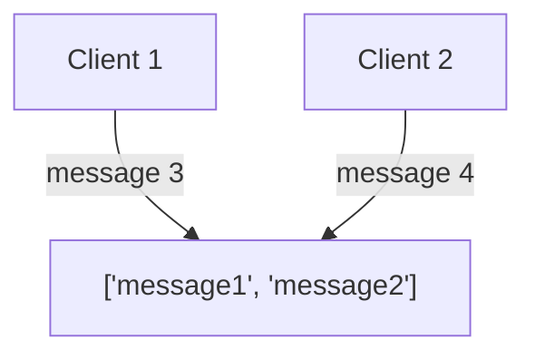

# WebSockets ile Gerçek Zamanlı İletişim

---
layout: center
---

# Twitch Chat



---
layout: center
---

# Hadi bunu hayata geçirelim!

---

# Server Tarafı

````md magic-move
```ts
const messages = ["first message"];

Deno.serve(async (req) => {
  const path = new URL(req.url).pathname;
  if (req.method === "GET") {
    const html = await Deno.open("./index.html", { read: true });
  }
  return new Response("Not found", { status: 404 });
});
```

```ts
const path = new URL(req.url).pathname;
if (req.method === "GET") {
  switch (path) {
    case "/": {
      const html = await Deno.open("./index.html", { read: true });
      return new Response(html.readable);
    }
    case "/messages": {
      return new Response(JSON.stringify(messages));
    }
  }
}
```

```ts
if (req.method === "POST") {
  const message = await req.json();
  messages.push(message);
  return new Response("Message created", { status: 201 });
}
```
````

---

# Client Tarafı

````md magic-move
```html
<body>
  <div>
    <div id="messages"></div>
  </div>
  <form method="post">
    <input type="text" name="message" />
    <input type="submit" value="Submit" />
  </form>
</body>
```

```html
<body>
  <form method="post">
    <input type="text" name="message" />
    <input type="submit" value="Submit" />
  </form>

  <script>
    const form = document.querySelector("form");
  </script>
</body>
```

```js
const form = document.querySelector("form");
form.addEventListener("submit", async (e) => {
  e.preventDefault();
});
```

```js
const form = document.querySelector("form");
form.addEventListener("submit", async (e) => {
  e.preventDefault();
  const message = e.target.message.value;
  const response = await fetch("http://localhost:8000/messages", {
    method: "POST",
    headers: {
      "Content-Type": "application/json",
    },
    body: JSON.stringify(message),
  });
  console.log(response.statusText);
});
```

```js
async function renderMessages() {
  const response = await fetch("http://localhost:8000/messages");
  const messages = await response.json();
}
```

```js
async function renderMessages() {
  const response = await fetch("http://localhost:8000/messages");
  const messages = await response.json();
  const messagesDiv = document.getElementById("messages");
  for (const message of messages) {
  }
}
```

```js
async function renderMessages() {
  const response = await fetch("http://localhost:8000/messages");
  const messages = await response.json();
  const messagesDiv = document.getElementById("messages");
  for (const message of messages) {
    const messageDiv = document.createElement("div");
    messageDiv.textContent = message;
    messagesDiv.appendChild(messageDiv);
  }
}
```

```js
async function renderMessages() {
  const response = await fetch("http://localhost:8000/messages");
  const messages = await response.json();
  const messagesDiv = document.getElementById("messages");
  for (const message of messages) {
    const messageDiv = document.createElement("div");
    messageDiv.textContent = message;
    messagesDiv.appendChild(messageDiv);
  }
}
renderMessages();
```
````

---
layout: center
---

# Yeni mesajları göremiyoruz

---

# Polling

```js
async function pollMessages() {
  //initial render
  await renderMessages();
  setInterval(() => {
    renderMessages();
  }, 1000);
}
pollMessages();
```

````md magic-move
```js
async function renderMessages() {
  const response = await fetch("http://localhost:8000/messages");
  const messages = await response.json();
  const messagesDiv = document.getElementById("messages");
  for (const message of messages) {
    const messageDiv = document.createElement("div");
    messageDiv.textContent = message;
    messagesDiv.appendChild(messageDiv);
  }
}
```

```js {5}
async function renderMessages() {
  const response = await fetch("http://localhost:8000/messages");
  const messages = await response.json();
  const messagesDiv = document.getElementById("messages");
  messagesDiv.innerHTML = "";
  for (const message of messages) {
    const messageDiv = document.createElement("div");
    messageDiv.textContent = message;
    messagesDiv.appendChild(messageDiv);
  }
}
```

```js
async function renderMessages() {
  const response = await fetch("http://localhost:8000/messages");
  const messages = await response.json();
  const messagesDiv = document.getElementById("messages");
  messagesDiv.innerHTML = "";
  for (const message of messages) {
    const messageDiv = document.createElement("div");
    messageDiv.textContent = message;
    messagesDiv.appendChild(messageDiv);
  }
}
```
````

---

# Polling ile İlgili Sorunlar

- High latency
- High CPU usage
- High bandwidth usage

---

# WebSockets Yardıma Koşuyor

- Hem gönderme hem de alma yönlerinde iletişimin gerçekleşebileceği tam çift yönlü(full-duplex) bir iletişim protokolüdür.
- Sürekli bir bağlantıdır, yani bağlantı kapatılana kadar açık kalır.
- Düşük gecikmeli bir iletişim protokolüdür.

---

# Nasıl Çalışır?

1. İstemci, WebSocket bağlantısı kurmak için sunucuya bir el sıkışma isteği gönderir.

```http
GET /chat HTTP/1.1
Host: server.example.com
Upgrade: websocket
Connection: Upgrade
```

2. Sunucu, WebSocket destekliyorsa bunu kabul eder.

```http
HTTP/1.1 101 Switching Protocols
Upgrade: websocket
Connection: Upgrade
```

3. Bağlantı kurulur. Her iki taraf da artık HTTP yerine WebSocket protokolünü kullanır.

---
layout: center
---

# WebSockets'ı uygulamamıza entegre edelim

---

# Server Tarafı

````md magic-move
```ts
const messages = ["first message"];
const sockets = new Set<WebSocket>();
```

```ts
if (req.method === "GET") {
  switch (path) {
    case "/": {
      const html = await Deno.open("./index.html", { read: true });
      return new Response(html.readable);
    }
    case "/messages": {
      return new Response(JSON.stringify(messages));
    }
  }
}
```

```ts {10-17}
if (req.method === "GET") {
  switch (path) {
    case "/": {
      const html = await Deno.open("./index.html", { read: true });
      return new Response(html.readable);
    }
    case "/messages": {
      return new Response(JSON.stringify(messages));
    }
    case "/ws": {
      const { socket, response } = Deno.upgradeWebSocket(req);
      sockets.add(socket);
      socket.addEventListener("close", () => {
        sockets.delete(socket);
      });
      return response;
    }
  }
}
```

```ts
if (req.method === "GET") {
  switch (path) {
    case "/": {
      const html = await Deno.open("./index.html", { read: true });
      return new Response(html.readable);
    }
    case "/messages": {
      return new Response(JSON.stringify(messages));
    }
    case "/ws": {
      const { socket, response } = Deno.upgradeWebSocket(req);
      sockets.add(socket);
      socket.addEventListener("close", () => {
        sockets.delete(socket);
      });
      return response;
    }
  }
}
```

```ts
if (req.method === "POST") {
  const message = await req.json();
  messages.push(message);
  return new Response("Message created", { status: 201 });
}
```

```ts {4-6}
if (req.method === "POST") {
  const message = await req.json();
  messages.push(message);
  for (const socket of sockets) {
    socket.send(message);
  }
  return new Response("Message created", { status: 201 });
}
```

```ts
if (req.method === "POST") {
  const message = await req.json();
  messages.push(message);
  for (const socket of sockets) {
    socket.send(message);
  }
  return new Response("Message created", { status: 201 });
}
```
````

---

# Client Tarafı

````md magic-move
```js
function connect() {
  const socket = new WebSocket("ws://localhost:8000/ws");
}
```

```js
function connect() {
  const socket = new WebSocket("ws://localhost:8000/ws");
  socket.addEventListener("open", () => {
    console.log("Connected to server");
  });
}
```

```js
function connect() {
  const socket = new WebSocket("ws://localhost:8000/ws");
  socket.addEventListener("open", () => {
    console.log("Connected to server");
  });
}
```

```js
function connect() {
  const socket = new WebSocket("ws://localhost:8000/ws");
  socket.addEventListener("open", () => {
    console.log("Connected to server");
  });
  socket.addEventListener("message", (event) => {});
}
```

```js
function connect() {
  const socket = new WebSocket("ws://localhost:8000/ws");
  socket.addEventListener("open", () => {
    console.log("Connected to server");
  });
  socket.addEventListener("message", (event) => {
    const messagesDiv = document.getElementById("messages");
    const messageDiv = document.createElement("div");
    messageDiv.textContent = event.data;
    messagesDiv.appendChild(messageDiv);
  });
}
```

```js
function connect() {
  const socket = new WebSocket("ws://localhost:8000/ws");
  socket.addEventListener("open", () => {
    console.log("Connected to server");
  });
  socket.addEventListener("message", (event) => {
    const messagesDiv = document.getElementById("messages");
    const messageDiv = document.createElement("div");
    messageDiv.textContent = event.data;
    messagesDiv.appendChild(messageDiv);
  });
}
connect();
```
````

---
layout: center
---

# Dinlediğiniz için teşekkürler!
